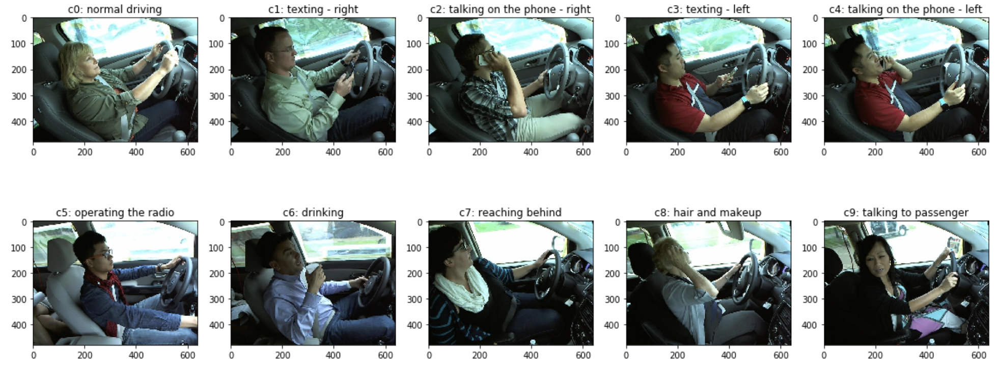

# Advanced Machine Learning project

## Distracted Driver Detection using Deep Learning Techniques

### Overview
Every year, millions of people are involved in car accidents due to distracted driving. This report explains how it is possible to prevent this problem by exploiting Deep Learning techniques for an images classification task, mainly applying Transfer Learning through the Fine-Tuning method. Several architec- tures are compared: a basic CNN from scratch and some architectures based on a pre-trained model such as MobileNet, VGG16 and VGG19. The use of imagenet weights as initial ones is fundamental to develop a high-performance model. Moreover, to adapt the model to the problem a Sequential Model- Based Optimization is performed, allowing to achieve satisfying results on new images, demonstrating a high level of generalization.



## Data

OS X & Linux:

```sh
npm install my-crazy-module --save
```

Windows:

```sh
edit autoexec.bat
```

## Notebook

A few motivating and useful examples of how your product can be used. Spice this up with code blocks and potentially more screenshots.

_For more examples and usage, please refer to the [Wiki][wiki]._

## Demo

This section presents an application of the project of two new drivers. For each frame is reported the expected class with the relative probability of belonging.

### Driver 1

<p align="center">
  
</p>

The full video can be found at the following link: [Driver 1][Driver 1].

### Driver 2

<p align="center">
  
</p>

The full video can be found at the following link: [Driver 2][Driver 2].

## References

* 0.2.1
    * CHANGE: Update docs (module code remains unchanged)
* 0.2.0
    * CHANGE: Remove `setDefaultXYZ()`
    * ADD: Add `init()`
* 0.1.1
    * FIX: Crash when calling `baz()` (Thanks @GenerousContributorName!)
* 0.1.0
    * The first proper release
    * CHANGE: Rename `foo()` to `bar()`
* 0.0.1
    * Work in progress

## About us

### Alessandro Riboni - M.Sc. Data Science Student @ University of Milano-Bicocca
  * a.riboni2@campus.unimib.it
  * [Linkedin](https://www.linkedin.com/in/alessandro-riboni-36310a182/)
  * [gitHub](https://github.com/aleriboni)

### Davide Sangalli - M.Sc. Data Science Student @ University of Milano-Bicocca
    * d.sangalli5@campus.unimib.it
    * [Linkedin](https://www.linkedin.com/in/davide-sangalli-867b8518a/)
    * [gitHub](https://github.com/)

### Federico Signoretta - M.Sc. Data Science Student @ University of Milano-Bicocca
    * f.signoretta@campus.unimib.it
    * [Linkedin](https://www.linkedin.com/in/federico-signoretta-46a387160/)
    * [gitHub](https://github.com/fedesigno)


## Contributing

1. Fork it (<https://github.com/yourname/yourproject/fork>)
2. Create your feature branch (`git checkout -b feature/fooBar`)
3. Commit your changes (`git commit -am 'Add some fooBar'`)
4. Push to the branch (`git push origin feature/fooBar`)
5. Create a new Pull Request

<!-- Markdown link & img dfn's -->
[npm-image]: https://img.shields.io/npm/v/datadog-metrics.svg?style=flat-square
[npm-url]: https://npmjs.org/package/datadog-metrics
[npm-downloads]: https://img.shields.io/npm/dm/datadog-metrics.svg?style=flat-square
[travis-image]: https://img.shields.io/travis/dbader/node-datadog-metrics/master.svg?style=flat-square
[travis-url]: https://travis-ci.org/dbader/node-datadog-metrics
[Driver 1]: https://drive.google.com/file/d/1zixpCV2qyfvxCU9fu316HdIquhn2ZlKQ/view?usp=sharing
[Driver 2]: https://drive.google.com/file/d/1KKKoshRfmocFeRyme4AFAM7LnMnoBLHK/view?usp=sharing
